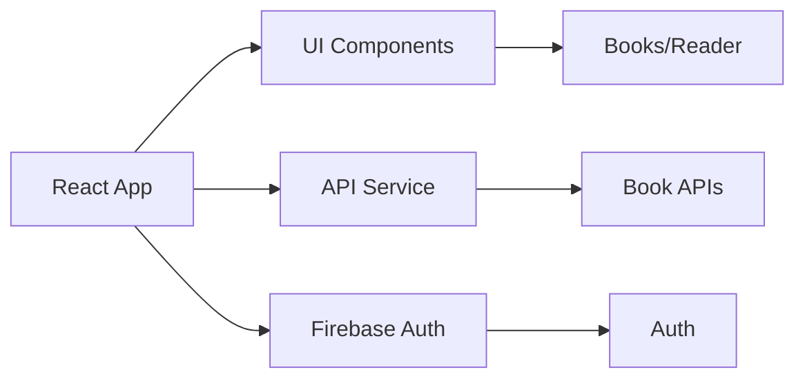

# 📚 Free Kindle — Read Anywhere

An open-source web ebook reader for discovering, importing, and reading EPUB books anywhere.


## Features

- Multi-source catalog (4800+ books)
- In-browser EPUB reader
- PDF viewer
- Internet Archive integration
- Open Library & Gutenberg search
- Google Drive library
- Web URL import
- Firebase authentication (Google, Microsoft, Email)
- Personal bookshelf & readlist
- 12 curated genre categories
- Dark theme UI

## Tech Stack

| Technology | Description |
| --- | --- |
| React 19 | UI Library |
| Vite 8 | Build Tool |
| Firebase Auth | Authentication |
| react-reader | EPUB Reader (epub.js) |
| Lucide React | Icons |
| Vercel | Hosting |

## Quick Start

```bash
git clone https://github.com/yourusername/free-kindle.git
cd free-kindle
cp .env.example .env
# Fill in your Firebase keys in .env
npm install
npm run dev
```

## Environment Variables

| Variable | Description |
| --- | --- |
| `VITE_FIREBASE_API_KEY` | Firebase API Key |
| `VITE_FIREBASE_AUTH_DOMAIN` | Firebase Auth Domain |
| `VITE_FIREBASE_PROJECT_ID` | Firebase Project ID |
| `VITE_FIREBASE_STORAGE_BUCKET` | Firebase Storage Bucket |
| `VITE_FIREBASE_MESSAGING_SENDER_ID` | Firebase Messaging Sender ID |
| `VITE_FIREBASE_APP_ID` | Firebase App ID |
| `VITE_FIREBASE_MEASUREMENT_ID` | Firebase Measurement ID |

## Project Structure

```
src/
  ├── components/
  ├── config/
  ├── contexts/
  ├── hooks/
  ├── pages/
  ├── services/
  ├── App.tsx
  └── main.tsx
```

## Architecture



## Deployment

The app is deployed on Vercel. You can build it locally with:
```bash
npm run build
```

Live Site: [https://free-kindle.vercel.app](https://free-kindle.vercel.app)

## Contributing
Contributions are welcome! Please open an issue or submit a pull request.

## License
MIT License
